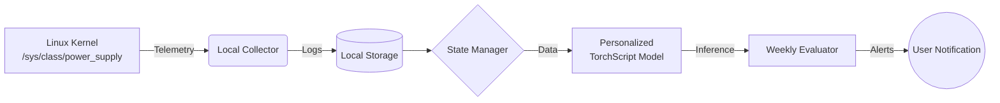

# 🔋 Battery Health Monitoring System
### On-Device · Personalized · Offline · Linux


## ⬇️ Download

> ⚠️ **Platform Support**
>
> This application is **supported only on Linux systems**.
>  
> It relies on Linux kernel interfaces (`/sys/class/power_supply`) and
> systemd services, which are **not available on Windows or macOS**.

**Latest stable release:**

👉 [Download Battery Health Monitor v1.0](https://github.com/<your-username>/<repo-name>/releases/latest)

### Quick install (Linux only)
```bash
tar -xzvf battery_health_app_v1.0.tar.gz
cd battery_health_app
sudo ./install.sh


```

> **⚠️ Note:** This repository contains the **deployed application** designed to run silently in the background on Linux laptops.
> **It contains no training pipelines.** For model training and MLOps, please refer to the companion repository.

This system collects real battery telemetry from the Linux kernel, learns user-specific "normal" behavior, and detects long-term anomalies conservatively—all while running **fully offline** as a system service.

---

## 🎯 What This Application Does

Once installed, the app operates autonomously:

1.  **Collects** battery performance data every few minutes.
2.  **Observes** user behavior during an initial "Warm-Up" period.
3.  **Personalizes** itself once using on-device data.
4.  **Monitors** battery health weekly.
5.  **Notifies** the user *only* on sustained anomalies.

### Key Features
* ❌ **No Dashboards:** Designed to be invisible until needed.
* ❌ **No Constant Alerts:** Prevents notification fatigue.
* ❌ **No Cloud:** Zero data exfiltration.

## 🧠 Design Philosophy

Battery degradation is **gradual**, **user-specific**, and **usage-dependent**. To handle this complexity effectively, we avoid rigid rules in favor of adaptive logic.

| This System Avoids ❌ | Instead, It Relies On ✅ |
| :--- | :--- |
| **Fixed Thresholds** | Relative Baselines |
| **Noisy Alerts** | Long-Term Trends |
| **Frequent Retraining** | Conservative Logic & Stability |

---

## 🏗️ System Architecture (Runtime)

The system operates as a closed loop on the device.



## 📂 Application Structure

```text
battery_health_app/
├── app.py                   # Main system entrypoint
├── collector/               # Reads battery telemetry from /sys/class/...
├── storage/                 # Handles CSV logging & log rotation
├── state/                   # Manages lifecycle (WarmUp -> Runtime)
├── personalize/             # Logic for one-time fine-tuning
├── runtime/                 # Weekly monitoring & evaluation logic
├── models/                  # Optimized TorchScript models
├── data/
│   └── local/               # User's local battery logs
├── venv/                    # Bundled Python environment
├── systemd/                 # Service & timer definitions
├── install.sh               # Setup script
├── uninstall.sh             # Cleanup script
└── README.md
```

## 🔄 Application Lifecycle

The system follows a strict, deterministic lifecycle to ensure reliability.

### 1. 🟦 Warm-Up Phase (Initial Install)
* **Duration:** ~4 Weeks
* **Activity:** Data collection only.
* **Status:** No alerts, no learning. The system is simply observing your baseline usage.

### 2. 🟨 Personalization Phase (One-Time)
* **Trigger:** Occurs automatically after Warm-Up.
* **Activity:** Fine-tunes the model using *only* your Month-1 data.
* **Safety:** Updates the Encoder only (Decoder remains frozen). If personalization fails, it safely falls back to the base model.
* **Reason:** "Normal" battery behavior cannot be predefined; it must be learned from you.

### 3. 🟥 Runtime Monitoring (Steady State)
* **Activity:** Weekly inference against a rolling monthly baseline.
* **Health States:**
    * 🟢 **Normal**
    * 🟡 **Warning**
    * 🔴 **Sustained Anomaly**
* **Notification:** You are notified *only* if the system detects a **Sustained Anomaly** (2 consecutive red weeks).

---

## 🔍 What Is Monitored

The system reads directly from `/sys/class/power_supply/` to ensure kernel-level accuracy without vendor lock-in.

* **Energy:** Charge cycles and capacity.
* **Voltage:** Fluctuation patterns.
* **Power:** Discharge rates and draw.
* **Behavior:** Charge/Discharge consistency.

---

## 🔐 Privacy & Security

We treat your data with absolute privacy.

* ✅ **Fully Offline:** All computation happens on your device.
* ✅ **No Cloud:** Zero communication with external servers.
* ✅ **No Export:** Raw data never leaves the `/opt/battery_health/` directory.
* ✅ **No Identifiers:** No PII (Personally Identifiable Information) is collected.
* ✅ **Read-Only:** The app only *reads* battery stats; it never alters power settings.

## ⚙️ Installation

### Requirements
* **Linux** (Tested on Ubuntu/Debian/Fedora)
* **Python ≥ 3.8** (Bundled in virtual env, no system pollution)
* **Internet:** Not required for runtime (only for initial download).

### 🚀 Quick Start

1.  **Install:**
    ```bash
    tar -xzvf battery_health_app_v1.0.tar.gz
    cd battery_health_app
    sudo ./install.sh
    ```

2.  **Uninstall:**
    ```bash
    sudo ./uninstall.sh
    ```

---

## 🕒 Background Execution

The app runs as a `systemd` timer service, designed to be invisible.

* **Schedule:** Executes every **5 minutes**.
* **Resilience:** Automatically survives reboots.
* **Logging:** Silent on success; logs errors to `journalctl`.

**Check Service Status:**
```bash
systemctl status battery-health.timer
journalctl -u battery-health.service
```

## 🧪 Verification

Since this application runs silently in the background without a GUI, use the following commands to verify its status:

1.  **Check Data Collection:**
    Ensure telemetry logs are being created.
    ```bash
    ls -l /opt/battery_health/data/local
    ```
    *You should see timestamped CSV files appearing here.*

2.  **Inspect System State:**
    View the current lifecycle phase (e.g., `WARM_UP`, `RUNTIME`).
    ```bash
    cat /opt/battery_health/state/state.json
    ```

3.  **View Monitoring Logs:**
    Check the weekly inference results.
    ```bash
    cat /opt/battery_health/runtime/weekly_log.csv
    ```
    *Note: If the file is empty or missing, the system may still be in the Warm-Up phase.*

---

## 🔄 Updates & Model Replacement

The system supports safe, manual updates. To maintain reliability, the following logic applies when the application is updated:

1.  **Base Model Replacement:** When a new `base_model.pt` is deployed, it replaces the existing one.
2.  **Personalization Invalidation:** The existing personalized model is strictly bound to the old base model. It is immediately **invalidated** and deleted.
3.  **Reset to Warm-Up:** The system automatically re-enters the **Warm-Up Phase**.
    * *Why?* It must re-learn your baseline using the new model architecture to ensure alerts remain accurate.

---

## 🔗 Related Repository

This application is the **runtime** component. It relies on the research, training, and MLOps pipelines found in our companion repository:

**[Battery Health Anomaly Detection – Model Training & MLOps]**

That repository serves as the "Model Factory" and contains:
* Training Pipelines (ZenML)
* Offline Evaluation & Simulation
* Model Selection Logic
* MLflow Experiment Tracking
